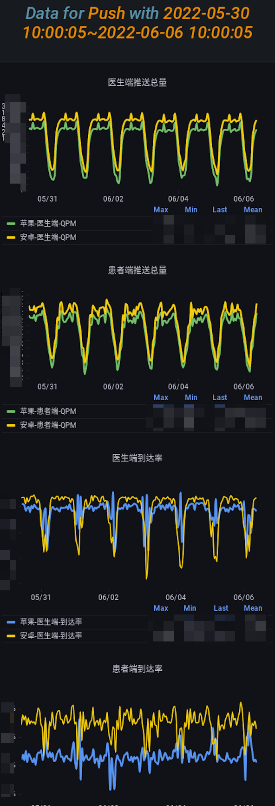

```json
{
  "date": "2022.06.22  11:26",
  "tags": ["消息推送","Push"],
  "description":"移动互联网蓬勃发展的今天，大部分手机 APP 都提供了消息推送功能，推送技术将传统靠'主动拉'获取信息的方式变成了信息主动寻找用户的方式，这更适合在移动网络中满足用户个性化信息的需求。好大夫APP推送功能主要应用于医患交流和订阅类关系的消息通知场景，基于医患交流的特殊性，用户更加看重消息的送达率和即时性。所以，好大夫离线消息推送系统的演进之路，其实质就是通过建设稳定、高效的消息推送系统，不断提升和保障推送服务的可用性和推送消息的送达率。",
  "musicId":"29723022"
}
```


# 好大夫APP离线消息推送系统演进之路

## 一、背景

移动互联网蓬勃发展的今天，大部分手机 APP 都提供了消息推送功能，推送技术将传统靠"主动拉"获取信息的方式变成了信息主动寻找用户的方式，这更适合在移动网络中满足用户个性化信息的需求。好大夫APP推送功能主要应用于医患交流和订阅类关系的消息通知场景，基于医患交流的特殊性，用户更加看重消息的送达率和即时性。所以，好大夫离线消息推送系统的演进之路，其实质就是通过建设稳定、高效的消息推送系统，不断提升和保障推送服务的可用性和推送消息的送达率。


## 二、系统高可用性建设之路

### 1.服务雏形 -- 推送工具

在互联网圈我们常说的一个词叫做：**“迭代”**，通常叫做**“小步试错，快速迭代”，**这正好也与好大夫离线消息推送系统的演化过程相对应。在初始阶段，推送服务也是本着**“先完成，再完美”**的实践原则落地。

最初，消息推送只是简单得被视为一个通知类工具，在医患交流过程中提醒接收方查看新的讯息，工作流程大致如下图所示：


初代推送服务也是为满足上述需求而设计，由PHP语言实现，推送架构设计非常简单，如图：


如果我们以面向功能实现的角度看待上面设计，那么足以实现当时业务的需求。但随着好大夫业务的发展及对服务质量要求的不断提升，尤其近年来，**医生问诊线上服务的回复效率成为衡量医生服务质量的关键性指标之一，患者对医生的回复更是满怀期待**，所以，消息提醒服务的稳定性及可靠性越来越被医生和患者所看重，在如此背景下，上面简易的推送设计其中隐藏的诸多问题便随之暴露无遗，引发用户大量投诉。

随着各类投诉问题纷至沓来，同时在生产实践中，我们也发现很多需要改善的地方，大概汇总如下：

- API接口调用失败时消息无重试机制，会导致该条消息丢失
- IOS证书每年都需定期更新，且线上线下配置不一致，每次更换都需投入开发和测试资源
- “个推服务”不支持离线推送*(注：当时不支持*)，导致安卓用户接收推送消息体验极差
- 安卓机型众多，某些机型数字角标功能未进行适配，用户体验较差
- 线上线下用户数据隔离性较差，测试消息偶尔被误发到线上用户
- PHP环境稳定性问题、测试调试问题等
- 推送没有配置消息回执，消息是否真正触达用户客户端，无从感知
- 无消息统计，每日推送下发量，各业务推送使用情况，推送消息到达率、点击率一概不知
- 服务没有配备相关的监控告警，服务故障无法即时介入，及时止损
- 缺乏数据支撑，消息推送问题排查困难，用户投诉问题处理起来相当棘手
- ... ...


等等以上问题亟待解决，这在当时那个阶段是我们不得不面对的挑战，为彻底解决上述问题，我们下定决心将推送服务进行重构。 

当然，这部分内容仅作为经验之谈和对过去的总结，也是希望诸位读者能够避而远之。


### 2.服务进化 -- 推送系统

#### 2.1 需求梳理

在大张旗鼓得进行服务重构时，我们认为随着公司业务发展，提升推送服务的稳定性已然成为重构目标中的重中之重。在重构前，结合业务场景重新审视消息推送这一基础服务，我们不仅要解决历史遗留性问题，更要从边缘性服务的历史地位中将其划分出来，将消息推送作为一个完整系统看待，而不仅仅是一个工具类。

那么，何为系统？ “**系统是由相互作用相互依赖的若干组成部分结合而成的，具有特定功能的有机整体。” -- 钱学森**，换句话说，为了提供更加稳定、可靠、高效的消息推送服务，推送系统除了要保障将消息准确有效的下发到用户之外，我们又抽象出基础功能、用户体验和运营服务三个层面，赋予了它更多的职能。


> **反思：如果继续将推送当成一个工具使用会有什么后果？**

> 如果只把推送当做一个工具，缺乏对消息推送的管理意识，只管将业务触发的消息统统下发，那么随着时间的推移，业务逻辑的累积，势必会导致很多无意义的消息和用户无感的内容频繁推给用户，最终导致用户不堪重负主动关闭通知权限，甚至会直接卸载App，从而流式用户。
>
> 所以，我们希望通过新推送系统的重构来避免上述问题，实现从消息推送发起到最终用户是否收到、是否点击进行全方位的数据分析，同时实现服务稳定性监控，以及通过消息点击率的数据走势最终体现出用户偏好，使产品的迭代优化更具目的性和可观测性。


#### 2.2 技术选型

在明确了需求之后，我们选择技术生态更为健全的 Java 体系作为初始环境，再之后更为关键的一步便是推送技术选型。结合旧有推送服务的运营经验，我们在推送技术选型时依据**“能直接依赖厂商服务则直接依赖”**的原则，制定了如下推送方案。


在做前期调研时，我们都会了解到诸如极光推送、个推、友盟、百度云等第三方推送服务，通过简单嵌入一个SDK即可实现消息推送功能。这里有人可能会问：“直接使用第三方推送服务，不仅开发成本低，而且成熟稳定，还提供了完善的后台功能，为什么不拿来直接使用呢？” 


正如上图对比分析，第三方服务虽然接入更加便捷，开发成本低，但是基于**服务稳定性**和**数据安全**两个方面，我们还是选择了直接对接厂商服务的技术方案。

> Tip：为什么厂商推送服务更加稳定？
>
> 这里主要指安卓端，由于国内对 Google 限制， 导致了Android GCM推送服务在国内不可用， 所以国内的终端厂商大部分移除了 GCM 模块，然后推出各自系统级别的推送服务， 例如小米系统的 MIPush， 华为系统HuaWeiPush， 魅族系统的 FlyMePush 等。作为定制系统的手机厂商， 从系统级别进行了推送支持。厂商推送的进程为系统常驻进程，这个进程不会被系统回收，而且一键清除也不会关闭，所以稳定。
>
> 而第三方服务，例如百度推送，作为非手机厂商的推送，它的核心原理是多个App共享一个长链接，只要有一个App存活那么推送就可以正常发送，这种全家桶式的推送服务由于集成用户多，相互唤醒概率较大，以此实现长连接的保活，实现相对稳定的推送服务。


此时我们还需要考虑另外两个问题：

1.**灵活程度：**如果确认是第三方服务不支持的功能或Bug导致用户投诉，而版本迭代修复需要较长周期，那么在此期间，我们该如何处理用户投诉？   *例如，我们在使用友盟服务给小米设备推送时期，因其不支持红米设备，面对红米设备用户的投诉只能将小米厂商服务纳入推送体系中来，但是已发行的客户端版本依旧面临用户投诉的挑战。*​

2.**成本问题**：若重度依赖第三方服务，随着企业业务深入发展，第三方提供的免费版本注定将不再适用，转向高级付费版本势必成为必然选择，那么企业是否愿意承担其高额开支？  *例如，友盟免费通道为众多APP共享通道，其发布QPS有最大限制，所以如果使用免费通道，受多方影响，我们势必会面临被限流的问题且不受控制。限流会导致推送消息发布失败或延迟，给用户带去不好的体验。此时第三方则会提供VIP独享通道的解决方案。*


当然，由于安卓机型种类繁多，各家厂商服务一次性全部接入的工作量巨大。所以为了兼容小众机型，全家桶式的推送服务我们依然需要引入，同时作为兜底的推送渠道使用。在调研第三方推送服务时，各家服务简要对比如下（*仅供参考*）：


*当然，第三方服务也是在不断升级迭代的，有些历史问题可能已经随着版本升级得到有效解决，详情请查阅最新官方文档。*


综上所述，我们最终采用“**尽量直接对接厂商服务，第三方服务兜底**”的策略来支撑推送服务。第三方服务采用友盟推送。 于是，便形成了如下的推送基础架构模型。


#### 2.3  推送通道高可用性优化

当然，很容易发现上述基础模型中各类机型都是单通道发送，并无高可用性相关设计。在生产实践中，我们遇到过两次推送故障，分别如下：

1. **厂商服务故障：**华为厂商API服务突然异常，期间导致华为推送全部失败。事后反馈是由于华为推送灰度上线异常导致。
2. **机房网络故障：**好大夫线上机房通往海外链路网络异常，导致请求APNS服务失败，期间IOS设备的消息推送全部失效，机房运维人员手动将电信出口切换至联通出口后服务恢复正常。


以上故障如果没有经过生产实践，很难在系统设计初就将其考虑进来，为实现推送系统的高可用性，我们在基础模型上衍生出了**链路备份**的演进策略，具体如下图：


在优化通往海外APNS服务的链路时，我们取巧利用阿里云机房多地部署的优势实现IOS推送的多出口，同时支持流量按比例实时调配，发送失败时支持多通道自动切换重试。 而在解决安卓推送厂商通道故障或异常的问题时，我们则使用友盟自建通道作为其他厂商备份通道的方式，尽可能的保障消息可达。


#### 2.4 如何保障推送消息不丢失

在互联网环境中充斥着很多低概率事件，如"网络故障"、“机器故障”及“自然灾害”等等。然而，小概率事件并非零概率事件。一旦发生，如果应对不善，突如其来的“黑天鹅”事件也会导致系统性风险、产生严重后果。原有的推送架构在系统防御性方面的设计不足，如遇网络波动等情形时，接口调用失败便会导致推送消息丢失。

所以，在好大夫推送系统高可用建设中，我们面临的另一个挑战就是——“如何尽可能的保障推送消息不丢失?" 答案是 ——**”消息队列“**，通过使用消息队列不仅提升了系统整体吞吐量，而且嫁接使用了消息队列中间件的稳定性和失败重试功能。


> 说明：消息队列作为公司级中间件应用，其稳定性要求高达99.99%以上，围绕消息队列中间件稳定性做了更多相关工作和资源投入，比如补偿机制、重试机制以及覆盖范围更加全面的监控告警等等，这里不再展开叙述


写到这里，好大夫离线消息推送系统已经进一步演化为一个相对比较成熟稳定的微服务系统，其核心架构大致如下：


#### 2.5 其他优化

西方谚语中常说”**魔鬼存在于细节之中（Devils in the details)**“，对于推送系统的优化，重构只是最粗粒度的手段，而实际上更多的优化往往是去深挖暗藏的细节。在细节优化过程中，我们也投入了相当一部分精力，大致简述如下：

- 全面升级APNS推送服务，采用p8 Token的授权方式取缔了原有p12证书授权方式，达到token过期自动刷新的效果，不再需要每个周期都投入资源进行证书的更新替换

- 使用开源Pushy服务进行IOS推送服务，提升苹果推送稳定性及性能

- 安卓端推送与各厂商合作，对重点业务推送申请定制高优先级通道，IOS侧则通过支持时间敏感型通知，保障消息稳定高效的触达用户，同时在强提醒方面(如铃声、震动、呼吸灯等)给予用户更优体验

- 升级各端推送SDK版本，使主流终端机型对消息内容的限制大幅提升，如苹果由最初128b提升至4k，华为由2k升至4k

- 支持单发、群发机制，可以一次给一个或者多个用户推送消息

- 彻底解决好大夫APP之间推送差异化问题，如医生版华为机型使用华为推送，而患者端华为机型却使用友盟推送的混乱问题

- 实现推送消息生命周期，从推送消息触发，到厂商下发，再到终端接收，以及最后的用户点击行为全过程链路串联及可视化

  > Tips: 判断推送消息是否接收实现方案
  >
  > 安卓端通过接入各大厂商消息回执功能实现，IOS侧由于APNS服务不支持回执功能，所以巧妙采用APNS通知服务扩展（Notification Service Extension）实时记录并上报推送消息接收日志，从而实现类似于安卓端消息回执的能力


## 三、系统稳定性运营建设之路

从唯物辩证法来看，推动新事物的产生和发展，从根本上讲就是不断认识矛盾、解决矛盾的过程。同样，对好大夫离线消息推送系统而言，在可用性建设告一段落之后，新的矛盾和问题也便随之浮出了水面。在生产实践过程中，我们又遇到了很多新的问题，譬如：

- 华为推送AccessToken获取失败导致华为通道推送失败，等到用户投诉时才开始人工介入排查
- 每日各业务推送量级是多少？消息成功率、到达率、点击率又是什么样？都处于黑盒状态
- 用户投诉推送收不到的相关问题时，如何快速定位问题根因？


《韩非子》中有句至理名言：”圣人见微以知著，见端以知末，故见象箸而怖，知天下不足也“ ，借指运用以小见大、见微知著的目光看待问题。同样，关于推送系统提到的上述三个问题，我们也可轻易看出其实质隐含的问题：

- [x] **系统缺乏监控告警**

- [x] **无确切的数据统计和分析，缺失系统画像**

- [x] **缺失故障排查诊断类辅助工具**

  

#### 3.1 系统监控告警建设

> 离开了监控系统，我们就没法辨别一个服务是不是在正常提供服务；没有一套设计周全的监控体系，就如同蒙着眼睛狂奔；监控系统是服务运维中不可或缺的一部分。—— 《Google SRE 解密》


当然，这里并不是想要打造一款监控系统，对于微服务应用本身更为关键的是如何提炼出关键性指标来监控服务的运行质量，Google SRE 建议我们，在实践时，应该思考从用户最关心的方面入手，对于消息推送系统而言，有以下两个方面对用户影响最大。

- 消息下发失败率
- 消息触达时延

所以，针对以上两个方面，我们设计了以下告警项*(仅展示部分供参考)*来监测推送服务的稳定性，同时结合告警系统的on-call机制，随时有值班人员第一时间做出应急响应，及时干预止损。


#### 3.2 系统可观测性建设

一个正在运行的系统除了提供业务功能，产生业务数据的同时还会产生很多“运行时”数据，我们可以将这些运行时数据分为：Metrics，tracing和logging。

> - Logging：用于记录离散的事件，包含程序执行到某一点或某一阶段的详细信息.
> - Metrics：可聚合的数据，且通常是固定类型的时序数据，包括 Counter、Gauge、Histogram 等.
> - Tracing：记录单个请求的处理流程，其中包括服务调用和处理时长等信息.


系统画像建设实际上就是基于Metrics，tracing和logging数据，通过一些度量分析和可视化工具对以上三类数据做收集、处理和分析展示，从而达到服务的“可视化”，以便让研发、测试、运维和技术管理者能拥有服务的全局视角，在一个管理后台中看到多个或单个应用的相关信息。

好大夫离线消息推送系统的服务画像也是基于上述原理实现，我们采用的是 **Prometheus + Grafana + Clickhouse** 的技术体系，以**全局到局部**的设计思路分别绘制了以下画像：


###### No1.画像首页 

主要从全局视角提供一个聚合页面，含推送系统本身的基础数据以及各端推送相关数据，如接口时延、推送达到率、点击率等。


###### No2.终端分类分析

根据设备分类进行详细分析，如首页中发现医生版APP安卓端推送送达率较低，那么本页即可具体分析是华为、小米、VIVO还是OPPO导致，以及低的原因是否为通知栏开关关闭。

> 经数据分析，用户主动将消息通知栏开关关闭是影响消息到达率的一个关键因素，所以引导用户打开APP通知栏开关是提升消息到达率很关键的一项优化措施。


继续深入，还可根据消息回执Code分布进行更加详细的根因分析


###### No3.长期趋势分析

长期趋势是对各项指标的长期统计，用于某段历史的回溯查验。数据存储主要是应用了**Clickhouse的稀疏索引能力**，从而实现在数据量巨大时仍可查询显示长期范围内的数据趋势，我们可对任何需要长期关注的指标进行类似处理，部分截图如下：


###### No4.服务风险分析

风险画像主要用于对服务面临的威胁、存在的脆弱性、现有防护措施及综合作用带来风险的发生可能性进行评估。我们主要梳理了一些可能会影响服务稳定性及业务使用合理性的指标进行综合考量。


###### No5.服务异常分析

服务异常表示应用程序当前不能正常提供服务，例如接口异常、队列消费者挂掉等等。


若厂商API接口服务异常，则可继续深入进行根因分析，以苹果推送为例如下：


###### No6.IOS出口流量分析

因APNS服务部署在国外，为避免运营商网络问题，我们使用了多个出口进行对外链路请求，所以需对各链路健康状态及流量配比进行实时监控，从而专门绘制此图。


###### No7.JMX画像&No8.资源画像

基础资源画像略，可参考Grafana官方提供的 expoter 实现。


###### No9.推送周报

移动互联时代，每天守在PC端盯着Dashboard查看是不现实的。所以我们会定期将关键指标绘制为周报的形式，以手机图片尺寸发布至工作群便于随时随地查看，部分截图如下，仅供参考。




###### No10.其他

当然，我们也初步探索了对消息点击的分析，通过点击分析挖掘用户对各业务的关注度, 以及活跃用户APP版本分布等有用信息。


#### 3.3 故障诊断平台建设

故障诊断的目标是定位某功能不能按预期工作的原因以及如何解决该问题。在日常工作中，出于种种原因依然会收到用户关于消息推送相关的建议和投诉，而排查问题往往是由运营侧反馈到开发侧，开发查完再解释给运营，来回沟通不仅效率低，而且大多数时候是重复性问题占用开发资源。为解决该类问题，我们设计了推送故障诊断平台专为运营服务，主要实现了如下功能：

- 获取用户近期推送概况
- 查看设备信息及在线状态
- 查看设备通知栏开关状态及历史变更
- 指定设备给用户发送测试消息
- 指定用户发送测试消息(用户多设备登录场景)
- 查看近期推送消息内容详情
- 查看推送消息链路详情


模型示例如图：


在处理用户推送相关的意见建议或投诉时，通过故障诊断平台进行”**一键诊断**“，协助用户快速定位并解决问题，‘傻瓜式’的操作，使用门槛几乎为”0“，为运营、测试人员赋能提效。


## 四、总结

荀子曰：“不积跬步无以至千里，不积小流无以成江海”，好大夫离线消息推送系统也是在生产实践中不断积累，由最初简单的一个通知工具演进为目前相对复杂的系统工程。作为好大夫业务发展背景下的一个终端运营产物，我们分别从技术和运营角度看待。

从技术角度看，历经可用性建设及稳定性运营建设两个阶段，目前基本满足了用户需求。

从运营角度看，消息推送是我们可以与用户直接进行有效交互的渠道和手段，属于用户激活方式中不可或缺的重要一环，切记谨慎使用，除功能性推送外，在不造成用户打扰的同时要尽可能的减少营销通知类推送，尽可能的结合用户偏好做到精准推送。同时，要意识到推送并不是一个工具，将消息推到设备即完成使命，更要关注后续数据的转化，并结合转化结果不断迭代产品方案，这样才能最大化利用推送这一利器。  

 

## 五、后续规划

> 从Android8到iOS15已经进入了推送博弈红海阶段，未来开发者面临通知服务的多项挑战。厂商通道通过通知分类逐步推进通知限额，通知作为历来被粗放漫灌的触达能力亟待回归 ** ROI(*投资回报率*)**本质，解决成本问题。**与以往对送达率的一味追求不同，未来考验怎么用更少的通知发送，更弱的用户打扰度，获取更高的用户积极反馈**。


长期以来，开发者在通知场景中主要关注送达率，历史中不乏通过流氓进程、频繁自启、链式唤起等手段一味追求高送达率。近些年，更多开发者尤其是行业TOP级产品将目标转向了点击率和实际业务正反馈（如唤起率）。这对通知运营提出了更高的要求，业务更加直白的关注通知所带来的业务效果，其中用户体验是绕不过去的一环。 所以，未来好大夫推送服务的发力点大概如下：


- **去繁从简** —— 梳理现有推送，进行合理化评估，如推送时段、频率是否合理等

- **交互优化** —— 丰富、优化推送消息的交互及展示效果，提升用户体验

- **提升转化** —— 引入转化率统计分析，重点关注消息着陆页设计

  

## 六、参考文章

[iOS10通知扩展之Notification Service Extension](https://www.jianshu.com/p/fd6d7906010d)

[划重点｜iOS15正式发布， 全新的通知推送系统，你必须要知道！](https://www.bilibili.com/read/cv13818550)

[Metrics, tracing, and logging](https://peter.bourgon.org/blog/2017/02/21/metrics-tracing-and-logging.html)


## 【作者简介】

刘伟：好大夫系统架构部工程师，专注于SRE、消息治理，负责好大夫客户端消息推送、消息中间件稳定性建设，以及好大夫Push PaaS、MQ PaaS平台的设计与实现。


"问渠哪得清如许，为有源头活水来。"   更多精彩内容，请关注“好大夫技术公众号（微信搜索“HaoDF技术团队）“