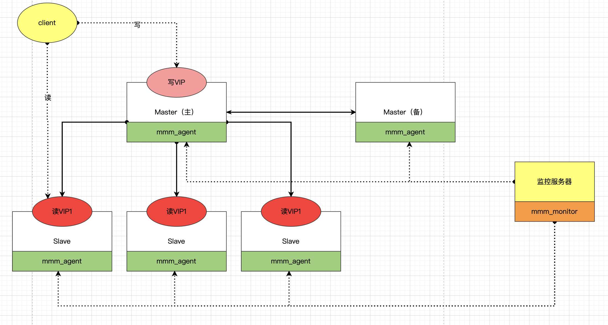
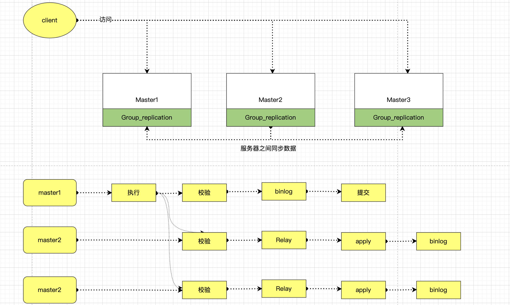

```json
{
  "date": "2022.05.19  20:22",
  "tags": ["数据库","MYSQL","mmm","mgr"],
  "description":"程序员在行外人的眼中总是不那么有趣、幽默。其实不然，五年程序生涯也算接触过不少程序员，发现其实程序员群体是一群有趣、单纯的人，相处很容易、也很舒服。这不日常聊天也不忘聊技术的宅男，被我硬掰都掰不弯~哈哈",
  "musicId":"1935738832"
}

```


一段有趣的对话

    同事小蓝：”ops自动发布是基于Jenkins吗？“
    
    我（一本正经）：”jenkins 和 gitlabci 只是参与ci ，构建完成推到harbor。 cd是ops自己搞得一套东西，分别部署虚拟机或者容器。“
    
    我继续：”以后容器里 cd估计是用ArgoCd这类开源的东西与ops直接交互。“
    
    同事小蓝（超自信）：”下次面试官再问我有没有自己部署过mysql主从，我就说别说部署了，自动发布都搞过。“
    
    我（疑惑）：”二者有什么关系吗？他提mysql主从 你应该给他讲讲mysql 的mmm和mgr架构【憨笑】“
    
    我：”考你一道？说说为什么要从3m转mgr？“
    
    同事小蓝：”巴拉巴拉... 应该是复制问题，具体忘了...“
    
    我：”NoNoNo，你应该回答  你TM要让我去做DBA嚒？“
    
    同事小蓝(哭笑)：”哈哈哈哈...“
虽然只是个笑话，但不可否认的是，确实在找工作时，什么样的牛马面试官都会遇到，所以我们多了解一些，还是有必要的。那么我们今天就发挥极客精神，深入扒一下MySQL mmm架构和mgr架构的异同。


### 一、写在前面

当然，我们还需要知道数据库的高可用用架构，远远不止我提到的这两种，常见的HA架构有：

- MMM （Multi Master Replication Manager）
- MHA   (Mysql Master High Availability)
- MGR  (Mysql Group Replication)
- PXC

当然，因为目前工作履历中也只见过mmm和mgr，所以我们主要先看下这两种架构。其他架构，读者可以通过科学搜索去探索哦。

### 二、什么是mmm(3m)架构



**故障转移步骤：**

1. slave服务器上的操作
   - 完成原主机上已经复制的日志恢复
   - 使用change master命令配置新主
2. 主服务器上的操作
   - 设置read_only关闭
   - VIP漂移到新的主服务器


**优点**：

- 读写都进行了VIP配置，使读写都可以达到高可用
- 工具包比较完善，不需要单独开发脚本(利好DBA，快速上手)
- 监控比较完善

**缺点**：

- 故障转移简单粗暴，容易丢失事务.(建议采用半同步复制方式，减少失败的概率)
- 主从延迟问题较为严重
- 目前MMM社区缺少维护，不支持GTID的复制
- 监控单点

### 二、什么是mgr架构



支持多主模式，但官方推荐单主模式：

- 多主模式下，客户端可以随机向MySQL节点写入数据
- 单主模式下，MGR集群会选出primary节点负责写请求，primary节点与其它节点都可以进行读请求处理.

**优点：**

- 基本无延迟，延迟比异步的小很多
- 支持多写模式，但是目前还不是很成熟
- 数据的强一致性，可以保证数据事务不丢失

**缺点:**

- 仅支持innodb
- 只能用在GTID模式下，且日志格式为row格式

适用的业务场景：

- 对主从延迟比较敏感
- 希望对对写服务提供高可用，又不想安装第三方软件
- 数据强一致的场景

### 三、为什么要从mmm架构转到mgr架构

技术迭代是与业务发展密不可分的，mmm架构我们也用了很久，只是随着业务量发展和使用过程中缺失维护，导致产生了很多的历史性债务，所以也就乘机转型甩掉历史包袱

- 主从延迟较大，用户投诉（mmm架构问题）
- 不支持GTID复制等 新型方式 （mmm架构问题）
- 单库存储量过大（>=1.8T），导致维护维护艰难 (运维问题)
- 商业、非商业业务混存，导致互相影响 （历史债务）
- ... ...

以上，即为我对mmm mgr的大致概况，非DBA的开发同学，我认为了解大致原理及历史背景即可，专业的深入研究还需要DBA同学去搞哦~~


以上！

